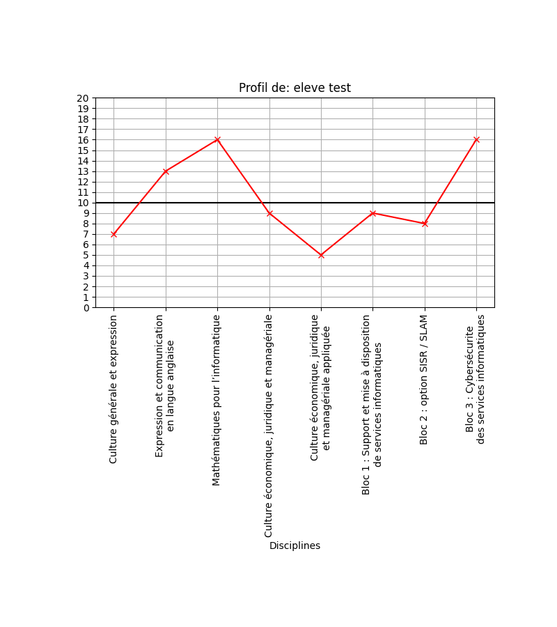

# livretBTS
depuis l'extraction pronote, produire les graphiques des livrets en BTS + formatage data.

1. extraire la liste des élèves de pronote vers un fichier tableur `eleves.ods`.

    - Y laisser les 2 champs: Nom  et date de naissance (utile ensuite).
    - une classe par onglet, exemples de nom: `SIO2`, `SIO2alt`
	
2. appliquer le script `prepa4pronote.py`: 

   il prépare des dossiers pour chaque onglet contenant un fichier tableur
   avec un onglet par élève où on peut coller les données de livret scolaire
   depuis pronote. (supprimer/recouvrir les 2 entrées de nom et date de
   naissance)
   
3. appliquer le script `get_livrets.py`: 

   il demandera de sélectionner le fichier des listes d'élèves
   
   → il tente alors de peupler chaque dossier avec les graphiques pour les livrets,
   ainsi qu'un fichier tableur avec les données reformatées pour les cases du
   livret.

**Attention**: Seules les données de 2e année sont donc traitées, il faut vous
débrouillez pour intégrer ensuite celles de 1ere année puis ajuster le format
des cases au modèle proposé par l'EN.

## fichiers

- `prepa4pronote.py`
- `get_livrets.py`
- `filieres.json`: possibilité d'améliorer et de généraliser à d'autres filières

## dépendances

Ces scripts dépendent des modules `pandas`, `matplotlib`, `XslxWriter`

pour les installer, dans un terminal, saisir:

    pip install pandas, matplotlib, XslxWriter

## TODO

Tenter d'intégrer des données de 1ere année; 
Gestion des remplacements de collègues (multiligne pour une même matière)…
Adapater à d'autres filières

